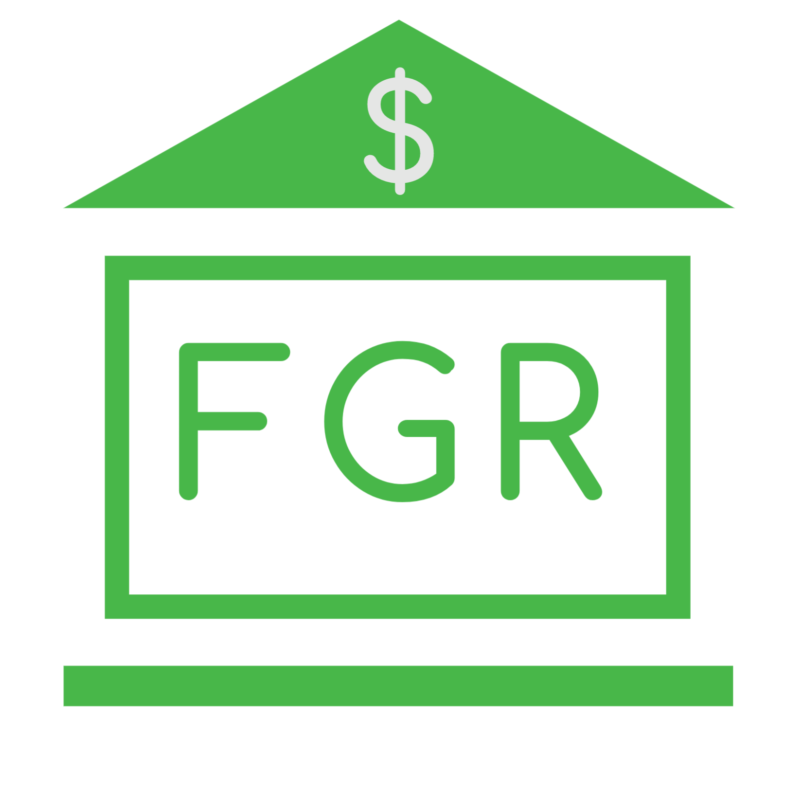
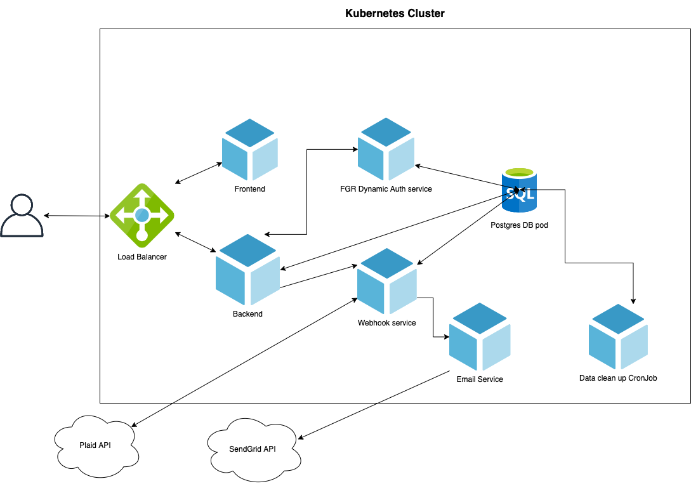
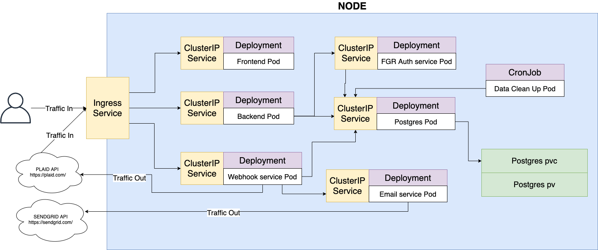

# FGR Kubernetes Demo

This repo is used to hold the kubernetes yaml files for starting up the [ FGR Kubernetes Demo](https://frankieriviera.com/portfolio/kubernetes-demo) by [Frankie Riviera](https://frankieriviera.com) 

You can find more detailed info on the [ FGR Kubernetes Demo here](https://frankieriviera.com/portfolio/kubernetes-demo)

Check out my [Online Portfolio](https://frankieriviera.com/portfolio) to see some of my other demos!

<!-- [ Check out the running Demo Here](http://kubernetes-demo.frankieriviera.com) -->

## I am a Cerified Kubernetes Application Developer

## What is the Demo?

This Kubernetes demo demonstrates my proficiency with Containerization, Kubernetes, and the building of full-scale applications from scratch using a microservice architecture. The application use case is a personal budget app that connects to bank accounts and allows users to track transactions, and manage budgets.

## A Brief Overview of Microservice Architecture

 

The image above displays the layout of the microservices within the Kubernetes demo. The budget app has a frontend client for interacting with the user. The backend is the gateway to the auth service and the database. The webhook service is hit by the external Plaid API where it stores transaction data in the database and notifies the user via the email service about new transactions, account balances or any other relevant user account info. The backend can also trigger the webhook immediately to get transactions from the Plaid API. To keep demo data light, there is a data clean up CronJob that removes data from the demo application periodically. The email service uses SendGrid to send email notifications.

## A Brief Overview of Kubernetes Cluster Objects

 

This diagram displays the inner setup of the Kubernetes cluster for the FGR Kubernetes demo. An ingress service using nginx-ingress controller is set up to allow for traffic to access frontend assets, call the backend, and also route to the webhook when the Plaid API notifies the application about new transactions. The base deployments are currently configured for one pod each, but could easily be scaled up to multiple pods if ingress traffic greatly increased. ClusterIP services are used to connect pods across the cluster. The CronJob has no need for a ClusterIP Service since no pods within the cluster need to access it. The Postgres pod connects to a Persistent Volume Claim which is bound to a Persistent Volume which maps data on to the Nodes file system. In a real world production application, your long-term persisting data should not rely on the Node's file system and should use more reliable external data persistence options. The current setup is intended to keep the demo simple and hosting expenses low.